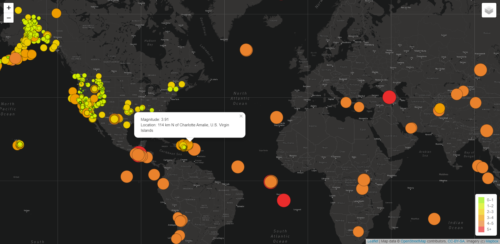
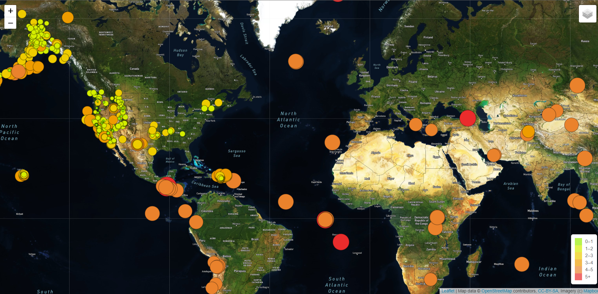
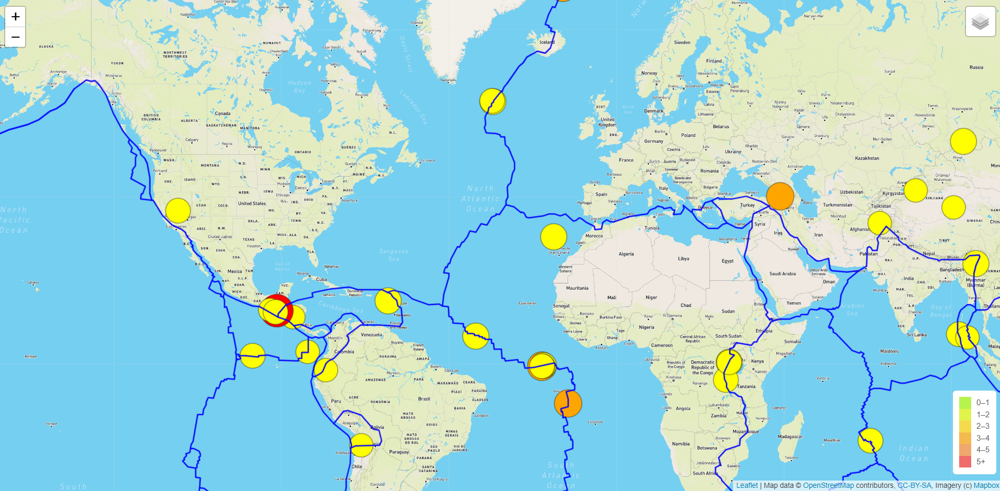
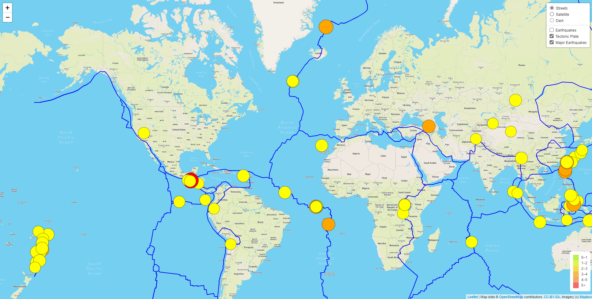

# Mapping_Earthquakes

## Overview of Project  

**Purpose:**  
The purpose of this project is to build tectonic plates, markers, and layers of a map for earthquakes around the world.  

## Resources:  
- Data Source: [Major Earthquakes Data](https://earthquake.usgs.gov/earthquakes/feed/v1.0/summary/4.5_week.geojson), [Tectonic Plates Data](https://raw.githubusercontent.com/fraxen/tectonicplates/master/GeoJSON/PB2002_boundaries.json)  
- Software: VS code 1.63.2 (Javascript, HTML, CSS, Leaflet 1.7.1), [mapbox styles](https://docs.mapbox.com/api/maps/styles/)  

## Analysis and Results  

**Analysis:**  
For this project, we used Leaflet javascript to create an interactive map with layers and markers to display earthquakes around the world. We created different map layers to change from street view, satellite view, or a night time view. We also created color coded markers for the magnitude of the earthquakes and where the earthquakes took place. A popup marker will be displayed with greater details of the recorded magnitude and precise location of the earthquake. We also added a tectonic plates layer to display the location of the plates and can be displayed in conjunction with earthquake markers to provide greater visualization and understanding of the locations of the earthquakes.  

**Results:**  
When the user views our map, the user can switch between 3 different map views, satellite, street, or dark views. The user can also add or remove markers for earthquake locations, tectonic plates, and major earthquakes. Major earthquakes are color coded with yellow being less than or equal to 5, orange greater than 5 but less than or equal to 6, or red which is greater than 6 for the recorded magnitude. Popups will be displayed with further details about the earthquake for location and recorded magnitude if the user clicks on the marker(s) they are interested in viewing. Tectonic plate markers were also added to display where the tectonic plates are located.  
  
  
  
  

## Challenge Summary  

**Summary**  
The purpose of this challenge is to build markers and layers for an interactive map of earthquakes around the world.  

### Codes Used  
(Please look at specific files for codes used)  
Code for [building map layers and markers](https://github.com/tonywang3571/Mapping_Earthquakes/blob/master/Earthquakes_Challenge/static/js/challenge_logic.js)  
Code for [building webpage](https://github.com/tonywang3571/Mapping_Earthquakes/blob/master/Earthquakes_Challenge/index.html)  
Code for [styling webpage](https://github.com/tonywang3571/Mapping_Earthquakes/blob/master/Earthquakes_Challenge/static/css/style.css)  

